<div align="center">
# ANVIL

**AI 보조형 자가개선 웹 방어 시그니처 플랫폼**

공격 요청을 수집·분석하고 방어 룰을 생성·검증한 뒤, 관리자 승인에 따라 WAF에 안전하게 배포합니다.

<br />

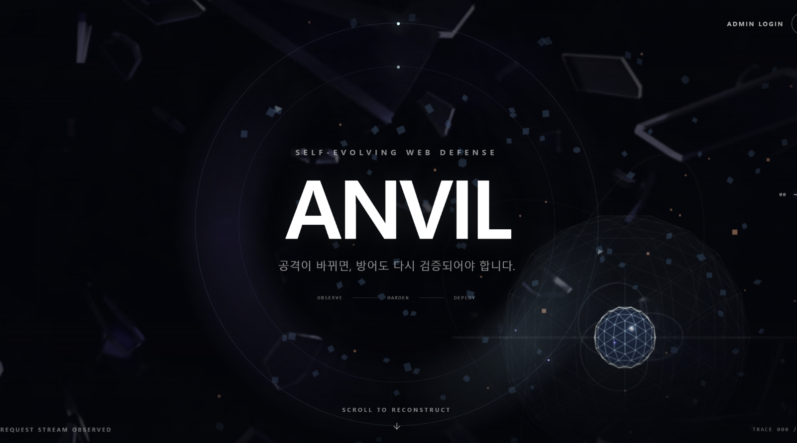

</div>

---

## Table of contents

- [Introduction](#introduction)
- [Demo](#demo)
- [Feature Specification](#기능-명세)
- [System Architecture](#system-architecture)
- [ERD](#erd)
- [Tech Stack](#tech-stack)
- [Directory Structure](#directory-structure)
- [How to Start](#how-to-start)
- [Developer](#developer)

## Introduction

ANVIL은 웹 공격 요청에서 반복되는 패턴을 찾아 방어 시그니처를 만들고, 우회 공격과 정상 요청을 이용해 룰을 검증한 뒤 WAF에 배포하는 보안 운영 플랫폼입니다.

Nginx·ModSecurity·OWASP CRS가 SQL Injection, XSS, Path Traversal 등의 의심 요청을 1차 탐지·차단합니다. ModSecurity 감사 로그는 OpenTelemetry Collector를 거쳐 Platform API로 수집되며, 운영 데이터는 PostgreSQL에, 검색·집계 데이터는 OpenSearch에 저장됩니다.

AI는 공격 의도 설명, 우회 방식 분석, 룰 개선 제안과 보안 리포트 생성을 보조합니다. 생성된 룰은 Sandbox·Holdout 검증과 AI 보강을 거쳐 리포트를 생성하고, 배포 전 OWASP ZAP 검증을 통과하면 Shadow 환경에 먼저 적용됩니다. 이후 Shadow 재검증과 관리자 승인을 거친 룰만 Active 상태로 전환됩니다.

### 주요 기능

- 보호할 웹 서비스 등록 및 연결 상태 확인
- WAF Gateway 기반 웹 공격 탐지·차단
- ModSecurity 감사 로그 수집·정규화·검색
- 공격 요청 기반 시그니처 룰 생성
- AI 보조 공격 분석 및 룰 개선 리포트
- Sandbox·Holdout·OWASP ZAP 검증
- Shadow 모니터링, 관리자 승인, Active 배포 및 Rollback
- OWASP CRS와 ANVIL 시그니처의 실제 차단 주체 추적

### 방어 룰 적용 흐름

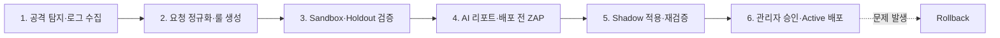

## Demo

### Demo Shop

보호 대상인 모의 쇼핑몰을 통해 정상 요청과 SQL Injection·XSS·Path Traversal 공격 요청을 재현합니다.

<p align="center">
  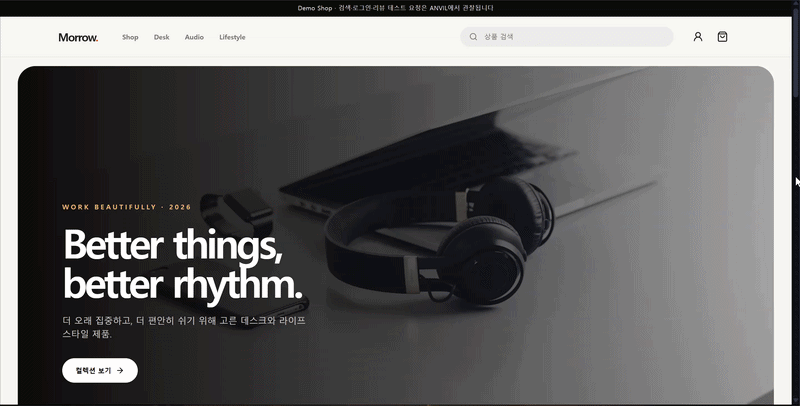
</p>

### Onboarding

보호할 서비스의 공개 주소와 Origin, WAF Proxy 정보를 등록하고 연결 상태를 확인합니다.

<p align="center">
  
</p>

### Dashboard

요청 수, 공격 탐지, 차단 현황, 룰 상태와 다음 운영 작업을 대시보드에서 확인합니다.

<p align="center">
  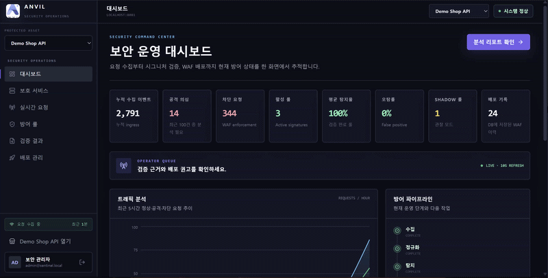
</p>

### Log Explorer

수집된 요청의 경로, 공격 유형, 심각도, 처리 결과와 실제 차단 주체를 조회합니다.

<p align="center">
  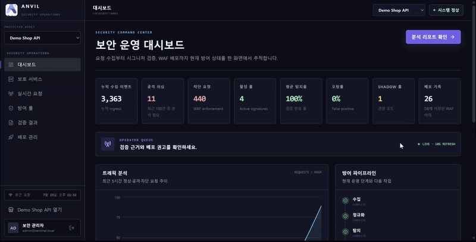
</p>

### Signature Rule Generation

탐지된 공격 요청을 기반으로 방어 시그니처를 생성하고 룰 정의와 버전 정보를 확인합니다.

<p align="center">
  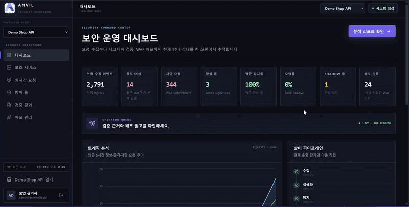
</p>

<p align="center">
  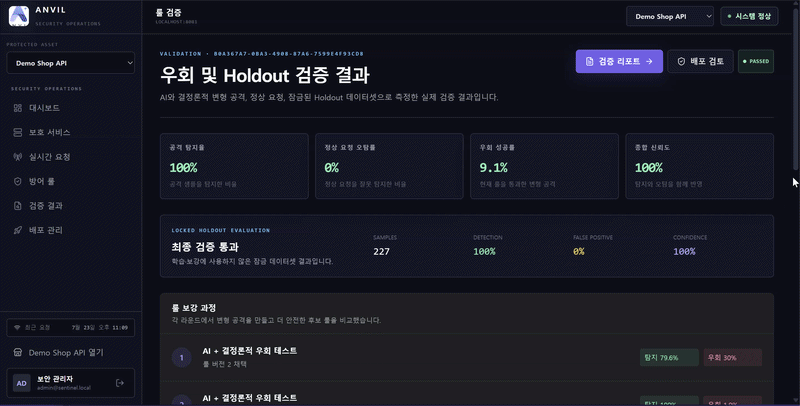
</p>

### AI Report

공격 의도, 우회 방식, 검증 지표와 배포 권고 사항을 관리자 친화적인 리포트로 제공합니다.

<p align="center">
  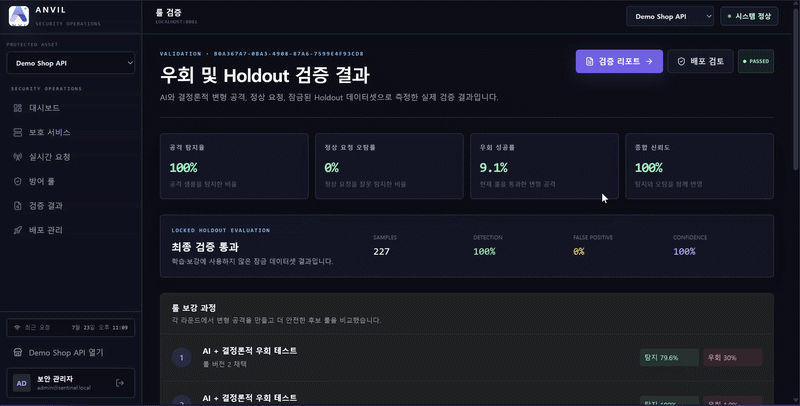
</p>

### OWASP ZAP Validation

배포 전후 OWASP ZAP 스캔으로 공격 탐지 여부와 새롭게 발생한 보안 문제를 검증합니다.

<p align="center">
  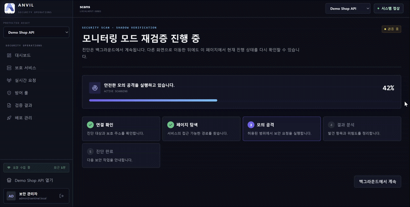
</p>

### Rule Deployment

검증을 통과한 룰을 Shadow 모드로 관찰한 뒤 관리자 승인에 따라 Active 상태로 배포합니다. 문제가 확인되면 적용된 룰을 Rollback할 수 있습니다.

<p align="center">
  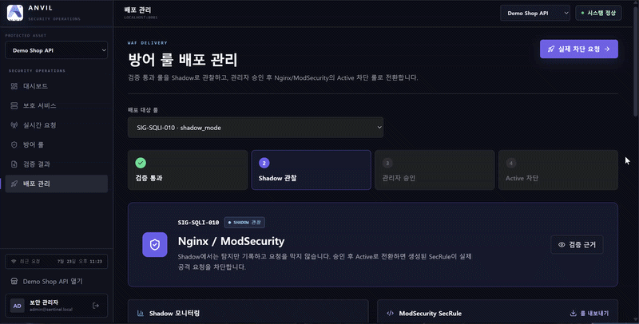
</p>

<p align="center">
  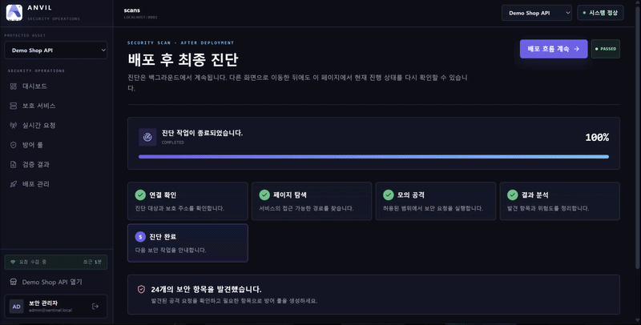
</p>

## 기능 명세

관리자 로그인부터 서비스 연결, 요청 수집·분석, 룰 생성·검증, 승인·배포까지의 구현 범위입니다.

<p align="center">
  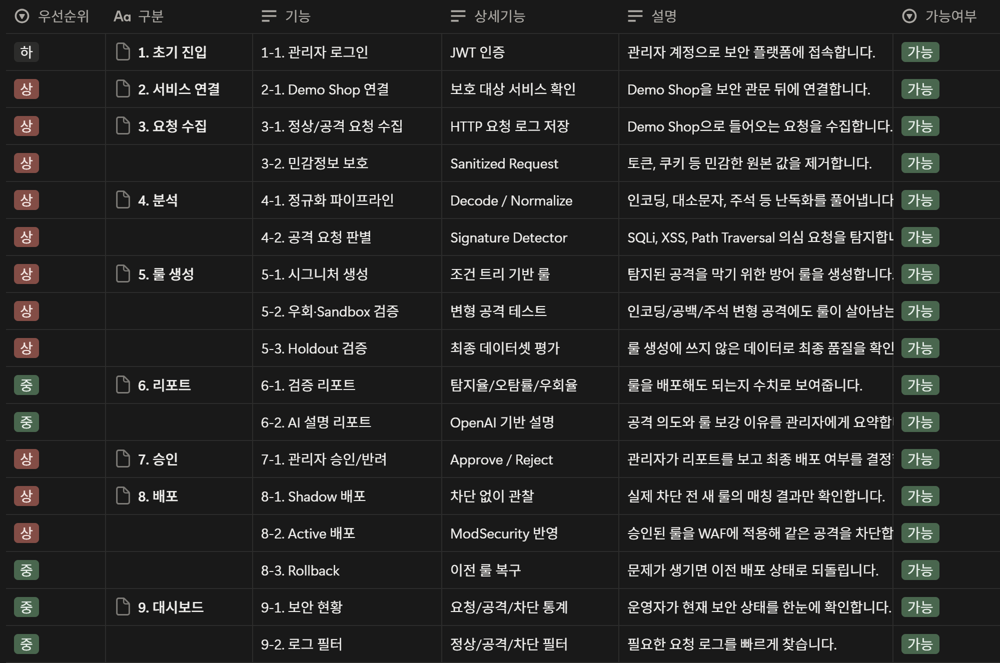
</p>

## System Architecture

<p align="center">
  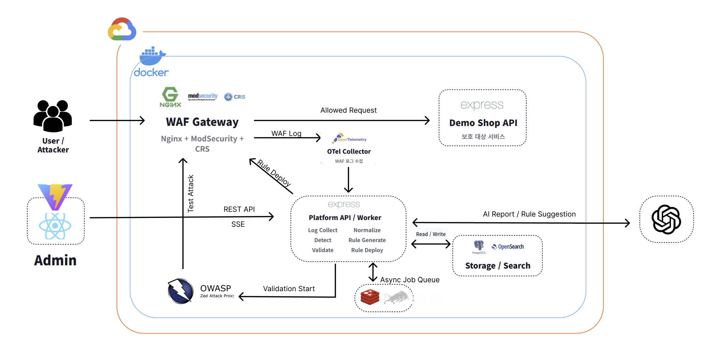
</p>

## ERD

<p align="center">
  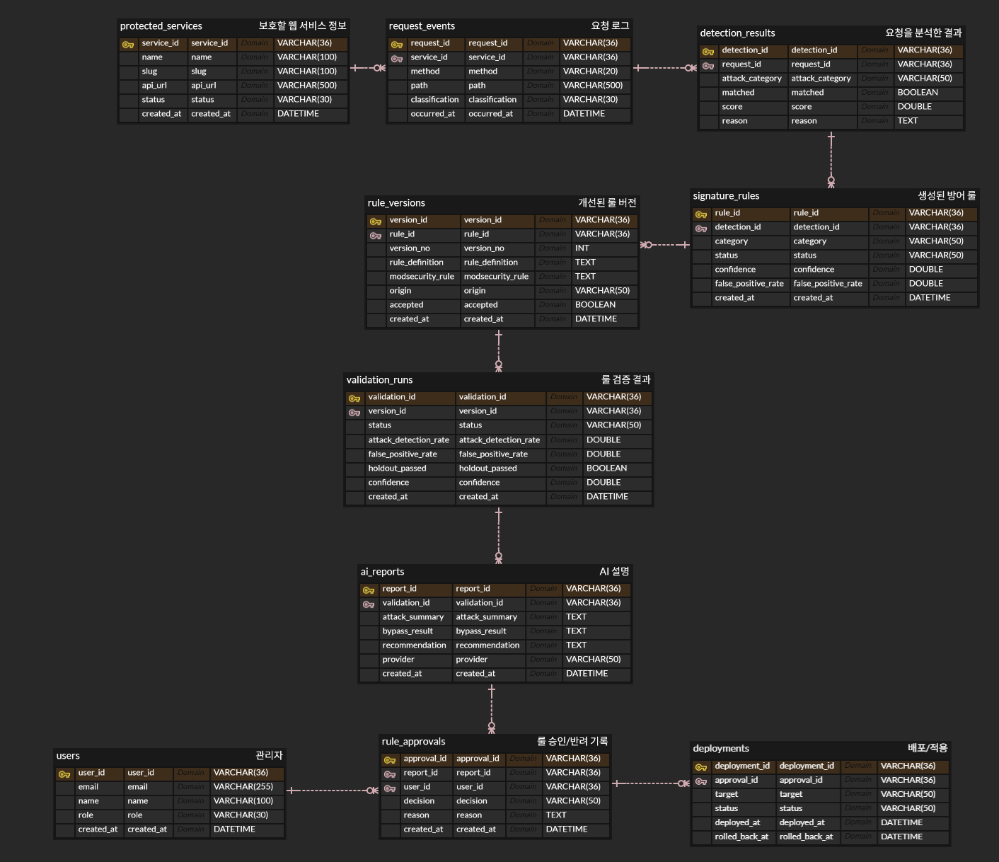
</p>

## Tech Stack

### Frontend

<p>
  
  
  
  
  
  
  
  
  
  
  
</p>

### Backend

<p>
  
  
  
  
  
  
  
  
</p>

### Database & Queue

<p>
  
  
  
  
</p>

### Security & Observability

<p>
  
  
  
  
  
</p>

### AI

<p>
  
</p>

### Testing & DevOps

<p>
  
  
  
  
  
  
  
</p>

## Directory Structure

```text
siheung/
├─ apps/
│  ├─ frontend/               # React 관리자 콘솔과 Demo Shop
│  │  ├─ public/
│  │  └─ src/
│  │     ├─ components/
│  │     ├─ data/
│  │     ├─ lib/
│  │     ├─ pages/
│  │     ├─ services/
│  │     ├─ shop/
│  │     ├─ stores/
│  │     └─ types/
│  └─ backend/                # Express API, Worker, Prisma
│     ├─ prisma/
│     │  ├─ migrations/
│     │  └─ schema.prisma
│     └─ src/
│        ├─ config/
│        ├─ controllers/
│        ├─ data/
│        ├─ middlewares/
│        ├─ routes/
│        ├─ services/
│        ├─ schemas/
│        ├─ types/
│        ├─ utils/
│        └─ worker.ts
├─ deploy/                    # 운영 배포용 Nginx 설정
├─ readme-assets/             # README 이미지와 시연 GIF
├─ scripts/                   # 개발·배포 보조 스크립트
├─ waf/                       # ModSecurity 설정, 생성 룰, Reload 스크립트
├─ compose.yaml               # 로컬 Docker Compose 환경
├─ compose.production.yaml    # 운영 Docker Compose 환경
├─ otel-collector.yaml
└─ package.json               # npm workspaces
```

## How to Start

### Prerequisites

- Node.js와 npm
- Docker Desktop 또는 Docker Engine + Compose
- OpenAI 기능을 사용할 경우 OpenAI API Key

### 1. Repository clone

```bash
git clone https://github.com/2026-siheung-sw-bootcamp-team-H/project.git
cd project
npm install
```

### 2. Environment variables

`apps/backend/.env.example`을 복사해 `apps/backend/.env`을 생성합니다.

```bash
cp apps/backend/.env.example apps/backend/.env
```

최소한 아래 값은 로컬 환경에 맞게 변경합니다.

```dotenv
JWT_SECRET=replace-with-at-least-32-random-characters
HMAC_SECRET=replace-with-another-32-random-characters
TELEMETRY_TOKEN=replace-with-a-random-service-token
ADMIN_PASSWORD=change-me

# AI 기능을 사용할 때만 설정
AI_PROVIDER=openai
OPENAI_API_KEY=
```

실제 `.env` 파일과 API Key는 저장소에 커밋하지 않습니다.

### 3. Infrastructure and backend

```bash
docker compose up --build -d
```

### 4. Frontend

```bash
npm run frontend:dev
```

### 5. Access

| 서비스       | URL                            |
| ------------ | ------------------------------ |
| Frontend     | http://localhost:3000          |
| Platform API | http://localhost:4000          |
| Swagger UI   | http://localhost:4000/api-docs |
| WAF Gateway  | http://localhost:8080          |
| OpenSearch   | http://localhost:9200          |

### Useful commands

```bash
npm run dev
npm run typecheck
npm run lint
npm run format:check
npm run build
docker compose logs -f
docker compose down
```

## Developer

| Profile                                                                       | Name   | Role       | GitHub                                 |
| ----------------------------------------------------------------------------- | ------ | ---------- | -------------------------------------- |
|  | 김승민 | Full Stack | [@ksm0520](https://github.com/ksm0520) |
